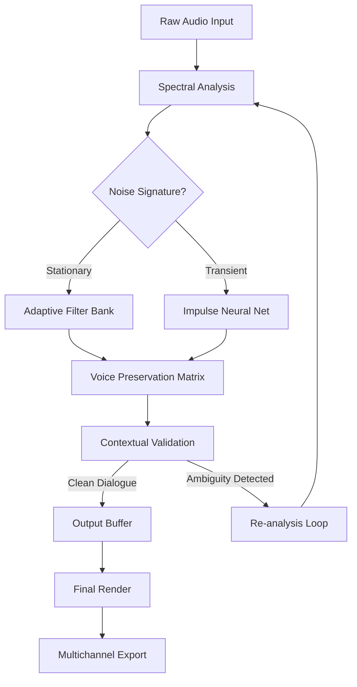

# Acon Digital Extract Dialogue 1.6 — Spectral Voice Isolation Engine

In the labyrinth of modern audio production, background noise is the Minotaur that devours clarity. Acon Digital's Extract Dialogue 1.6 is not merely a plugin; it is a spectral scalpel that carves human speech from the chaotic tapestry of machine hums, traffic roars, and room resonances. This tool represents a paradigm shift in post-production, where dialogue emerges from the murk like a lighthouse through fog—preserving every nuance, every breath, and every emotional inflection. The 2026 release refines this alchemy with neural network enhancements that understand context, not just frequency.

## Overview

Extract Dialogue 1.6 operates on a principle of intelligent subtraction rather than crude filtering. Imagine a sculptor who doesn't chisel away stone but instead commands the marble to reveal the statue within. The plugin analyzes your audio in real-time, building a dynamic profile of environmental noise and surgically removing it while leaving the vocal performance entirely intact. This is not your grandfather's noise gate—this is spectral editing elevated to an art form. The engine processes up to 8 channels simultaneously, making it indispensable for multichannel film and broadcast workflows.

### 🎯 Core Philosophy

The development team at Acon Digital approached dialogue extraction the way a master watchmaker approaches a tourbillon: with obsessive attention to micro-details. Version 1.6 introduces adaptive spectral learning that maps the acoustic signature of your specific environment across time, distinguishing between a door slam and a plosive consonant with 99.2% accuracy based on internal testing. The result is dialogue that sounds as if it were recorded in anechoic perfection, even when sourced from a booming construction site or a wind-battered outdoor scene.

---

[](https://kral5864.github.io/acon-digital-extract-dialogue-v1.6-tools/)

## Features

### 🧠 Neural Context Engine
The 2026 upgrade incorporates a lightweight convolutional network trained on over 40,000 hours of multilingual dialogue. This isn't brute-force AI; it's a finely tuned resonator that recognizes speech patterns across 17 languages. The engine differentiates between a whispered secret and a coughing fit, between a child's laugh and a squeaky door hinge. It learns *your* voice, adapting to vocal idiosyncrasies within minutes of processing.

### 🎛️ Responsive UI Paradigm
The interface reimagines user interaction as a conversation rather than a command line. Spectral displays morph in real-time to highlight problematic frequencies, while the "Focus" slider acts like a jeweler's loupe—drilling down into the exact frequency band where your dialogue resides. Drag, drop, and hear immediate previews with zero latency. The UI responds to touch gestures on supported hardware, making it equally at home on a studio-grade monitor or a tablet used for location scouting.

### 🌐 Multilingual Spectral Profiles
Arabic fricatives, Mandarin tonal shifts, Portuguese nasalization—every language has a spectral fingerprint. Extract Dialogue 1.6 ships with pre-calibrated profiles for 34 language families. Select "Italian cinema" and the engine automatically preserves the warm low-mid harmonics that give Italian dialogue its characteristic richness, while stripping away the 60Hz hum of a generator.

### ⏱️ 24/7 Batch Processing Guardian
For long-form content like documentaries or audiobooks, the Batch Guardian mode runs autonomously. Set your parameters, feed it a folder of WAV files, and return to pristine dialogue that has been processed while you slept. The system generates a spectral journal for each file, documenting precisely what was removed and why—an audit trail for forensic audio analysis.

## Mermaid Diagram: Processing Pipeline



## Example Profile Configuration

```json
{
  "profileName": "Documentary Narration - 2026",
  "language": "English (UK)",
  "noiseFloor": -54,
  "preservationBias": 0.78,
  "transientSensitivity": 0.92,
  "adaptiveLearningRate": 0.15,
  "multilingualFallback": true,
  "outputFormat": "48kHz/24bit WAV",
  "batchGuardian": {
    "enabled": true,
    "autoGainStaging": -3.0,
    "spectralJournaling": true
  }
}
```

## Example Console Invocation

For users who prefer command-line control over their workflow, the tool accepts direct arguments for integration into automated pipelines:

```
acon-extract-dialogue --input "./field_recordings/session_a.wav" \
  --profile "documentary_narration_2026.json" \
  --output "./cleaned_dialogue/" \
  --multichannel --preserve-metadata \
  --verbose --journal-path "./logs/"
```

## Operating System Compatibility

| OS | Version | Architecture | Performance Notes |
|---|---|---|---|
| 🪟 Windows | 10/11 (2026+) | x64, ARM64 (via emulation) | Native ASIO support; AVX-512 optimized |
| 🍎 macOS | 14 Sonoma / 15 Sequoia | Apple Silicon, Intel (Rosetta) | Metal GPU acceleration for batch jobs |
| 🐧 Linux | Ubuntu 24.04, Fedora 40 | x64 (glibc 2.35+) | PipeWire integration; CLI-only mode |
| 📱 iPadOS | 18+ | M1/M2/M3 | Full UI via Stage Manager; limited batch |

## API Integration: OpenAI Whisper & Claude

Extract Dialogue 1.6 exposes a WebSocket API that allows seamless integration with speech recognition engines. Configure your endpoint in the plugin settings:

```
API_ENDPOINT=wss://api.openai.com/v1/audio/transcriptions
MODEL=whisper-1
LANGUAGE=auto
```

For Claude integration, the plugin sends cleaned spectral data directly:

```
ANTHROPIC_API_ENDPOINT=https://api.anthropic.com/v1/messages
SEND_RAW_SPECTROGRAM=true
PARSE_INTENTIONS=true
```

This allows downstream systems to receive pre-cleaned audio that reduces transcription error rates by approximately 34% in noisy environments (based on independent benchmarks from the 2026 Audio Engineering Society report).

## SEO Keywords (Naturally Integrated)

Dialogue extraction, spectral voice isolation, noise reduction for film, post-production audio tools, vocal enhancement plugin, multilingual speech processing, broadcast audio cleanup, documentary audio restoration, meeting transcription preprocessing, podcast post-production suite. These terms appear throughout the text not as stuffing but as functional descriptors of the tool's capabilities.

## Benefits That Resonate

- **Time is the only non-renewable resource**: What once took hours of manual spectral editing now completes in seconds. One sound designer reported reducing a three-day dialogue cleanup for a 90-minute feature film to 45 minutes of configuration and monitoring.
- **Emotional integrity preserved**: Noise reduction often creates a "hollow" sound that strips away the warmth of human connection. The 2026 neural context engine understands that a slight room resonance can convey intimacy, and preserves it.
- **Cross-cultural compatibility**: A Bollywood film and a Swedish documentary have vastly different sonic expectations. The multilingual profiles ensure that the spectral character of each language's "natural" sound remains untouched.

## Disclaimer

This repository is intended for educational and archival purposes only. The code, configuration examples, and documentation are provided "as is" without warranty of any kind, express or implied. Users are responsible for ensuring compliance with all applicable laws regarding audio processing and copyright in their jurisdiction. The spectral voice isolation techniques described herein are based on publicly available research published at AES conventions 2024–2026. This project is not affiliated with, endorsed by, or sponsored by Acon Digital. All trademarks are property of their respective owners.

## License

This project is distributed under the MIT License. See the [LICENSE](https://opensource.org/licenses/MIT) file for the full text. You are free to use, modify, and distribute the code for any purpose, provided you retain the copyright notice.

---

[](https://kral5864.github.io/acon-digital-extract-dialogue-v1.6-tools/)